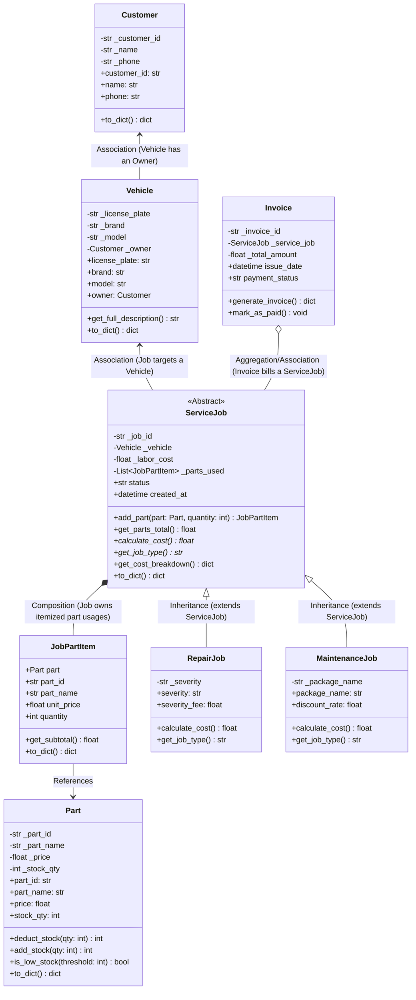

# 🚗 Car Garage & Repair Service System

> **Course Project:** Object-Oriented Programming (OOP) & Object-Oriented Analysis & Design (OOAD)  
> **Team Size:** 2 Persons  
> **Project Duration:** 2 Weeks  
> **Tech Stack:** Python FastAPI (Backend) + Next.js App Router & Bootstrap 5 (Frontend)

---

## 📌 1. System Architecture & OOP Design

The system models a commercial garage handling vehicle intake, technician work orders, parts inventory control, and billing. It strictly adheres to the **Four Pillars of OOP** and standard OOAD relationships:



---

## 🏛️ 2. Core OOP Principles Explained

| OOP Principle | Where & How It Is Implemented in Code |
| :--- | :--- |
| **1. Encapsulation** | - In `backend/models/part.py`: `_stock_qty` and `_price` are protected attributes accessed via getters and setters.<br>- Method `deduct_stock(qty)` guards against negative stock and overselling by validating stock levels before deducting.<br>- In `backend/models/customer.py` and `backend/models/vehicle.py`: All data fields validate input before modifying internal state. |
| **2. Inheritance** | - `ServiceJob` in `backend/models/service_job.py` is an **Abstract Base Class** (`abc.ABC`).<br>- `RepairJob` and `MaintenanceJob` inherit common state (`job_id`, `vehicle`, `labor_cost`, `parts_used`, `status`) and methods from `ServiceJob`. |
| **3. Polymorphism** | - Both subclasses override the abstract method `calculate_cost()` with unique business algorithms:<br>&nbsp;&nbsp;• **`RepairJob`**: `Total = labor_cost + parts_total + severity_fee`<br>&nbsp;&nbsp;• **`MaintenanceJob`**: `Total = (labor_cost + parts_total) - package_discount`<br>- In `backend/models/invoice.py`, `Invoice.generate_invoice()` calls `self.service_job.calculate_cost()` **polymorphically**, calculating the correct amount without needing `isinstance` checks! |
| **4. Composition** | - A `ServiceJob` owns a list of `JobPartItem` instances (`self._parts_used`).<br>- Calling `job.add_part(part, qty)` automatically delegates to `part.deduct_stock(qty)` and encapsulates the part's unit price at the time of service order creation. |
| **5. Association** | - A `Vehicle` has an associated `Customer` owner (`vehicle.owner = customer`). They are distinct entities that can exist independently. |

---

## 📂 3. Project Directory Structure

```text
car-garage/
├── backend/
│   ├── models/
│   │   ├── __init__.py           # Clean package exports
│   │   ├── customer.py           # Customer model (Encapsulation)
│   │   ├── vehicle.py            # Vehicle model (Association with Customer)
│   │   ├── part.py               # Part model (Encapsulation & deduct_stock)
│   │   ├── service_job.py        # ServiceJob (ABC), RepairJob & MaintenanceJob (Inheritance & Polymorphism)
│   │   └── invoice.py            # Invoice model (Polymorphic invoice generation)
│   ├── database.py               # In-memory storage handler & pre-seeded realistic data
│   ├── schemas.py                # Pydantic request/response validation schemas
│   └── main.py                   # FastAPI REST API endpoints
│
├── frontend/
│   ├── app/
│   │   ├── layout.tsx            # Global layout importing Bootstrap 5 CSS & Icons
│   │   ├── page.tsx              # Main Garage Dashboard (Grid, Cards, Tables)
│   │   └── globals.css           # Custom styling enhancements
│   ├── components/
│   │   ├── BootstrapClient.js    # Client-side dynamic loader for Bootstrap 5 JS bundle
│   │   ├── Navbar.js             # Sticky garage navbar with OOP badges & status
│   │   ├── StatsCards.js         # Top KPI metrics (Revenue, Stock alerts, Fleet)
│   │   ├── PartsInventory.js     # Real-time parts table with low-stock badges & restock action
│   │   ├── CreateServiceJob.js   # Polymorphic job creation form & live preview
│   │   ├── InvoiceList.js        # Past invoices history
│   │   ├── InvoiceModal.js       # Itemized receipt popup with financial breakdown
│   │   └── RegisterModal.js      # Modal to register new customers and vehicles
│   └── package.json
└── README.md
```

---

## 🚀 4. How to Run the System

### Prerequisites:
- Python 3.9+ (FastAPI & Uvicorn installed)
- Node.js 18+ & npm

---

### Step 1: Start the Backend (FastAPI)

In a terminal:

```bash
cd backend
# From project root:
uvicorn backend.main:app --reload --port 8000
```

- API Server runs at: `http://localhost:8000`
- Interactive Swagger UI Documentation: `http://localhost:8000/docs`
- ReDoc Documentation: `http://localhost:8000/redoc`

---

### Step 2: Start the Frontend (Next.js & Bootstrap 5)

In a second terminal:

```bash
cd frontend
npm install
npm run dev
```

- Open your browser to: `http://localhost:3000`

---

## 🎨 5. Bootstrap 5 Integration Details in Next.js

1. **Bootstrap 5 CSS & Icons**:
   - `bootstrap/dist/css/bootstrap.min.css` is imported directly into `frontend/app/layout.tsx`.
   - Bootstrap Icons CDN stylesheet is loaded via the `<head>` tag in `layout.tsx` for icons like `bi-wrench`, `bi-box-seam`, `bi-receipt`, etc.

2. **Bootstrap 5 JavaScript Bundle (Handling SSR)**:
   - Next.js App Router renders on the server by default. Directly importing Bootstrap's JS on the server causes `window is not defined` / `document is not defined`.
   - Solution: `frontend/components/BootstrapClient.js` is marked with `"use client"` and uses `useEffect(() => { import("bootstrap/dist/js/bootstrap.bundle.min.js"); }, [])` to safely load the Bootstrap JavaScript bundle once mounted in the browser.

---

## 🧪 6. Testing OOP Principles via API

### 1. View Parts Inventory & Stock Levels
```bash
curl -X GET http://localhost:8000/api/parts
```

### 2. Create a Repair Job (Inheritance & Polymorphism: Surcharge)
```bash
curl -X POST http://localhost:8000/api/jobs/repair \
  -H "Content-Type: application/json" \
  -d '{
    "license_plate": "ABC-1234",
    "labor_cost": 150.0,
    "description": "Brake caliper fix",
    "severity": "MAJOR",
    "parts": [{"part_id": "PART-001", "quantity": 1}],
    "auto_generate_invoice": true
  }'
```

### 3. Create a Maintenance Job (Inheritance & Polymorphism: Discount)
```bash
curl -X POST http://localhost:8000/api/jobs/maintenance \
  -H "Content-Type: application/json" \
  -d '{
    "license_plate": "XYZ-7890",
    "labor_cost": 100.0,
    "description": "10,000 km Scheduled Service",
    "package_name": "PERIODIC_10K",
    "parts": [{"part_id": "PART-002", "quantity": 1}],
    "auto_generate_invoice": true
  }'
```

### 4. Fetch Generated Invoice
```bash
curl -X GET http://localhost:8000/api/invoices
```
