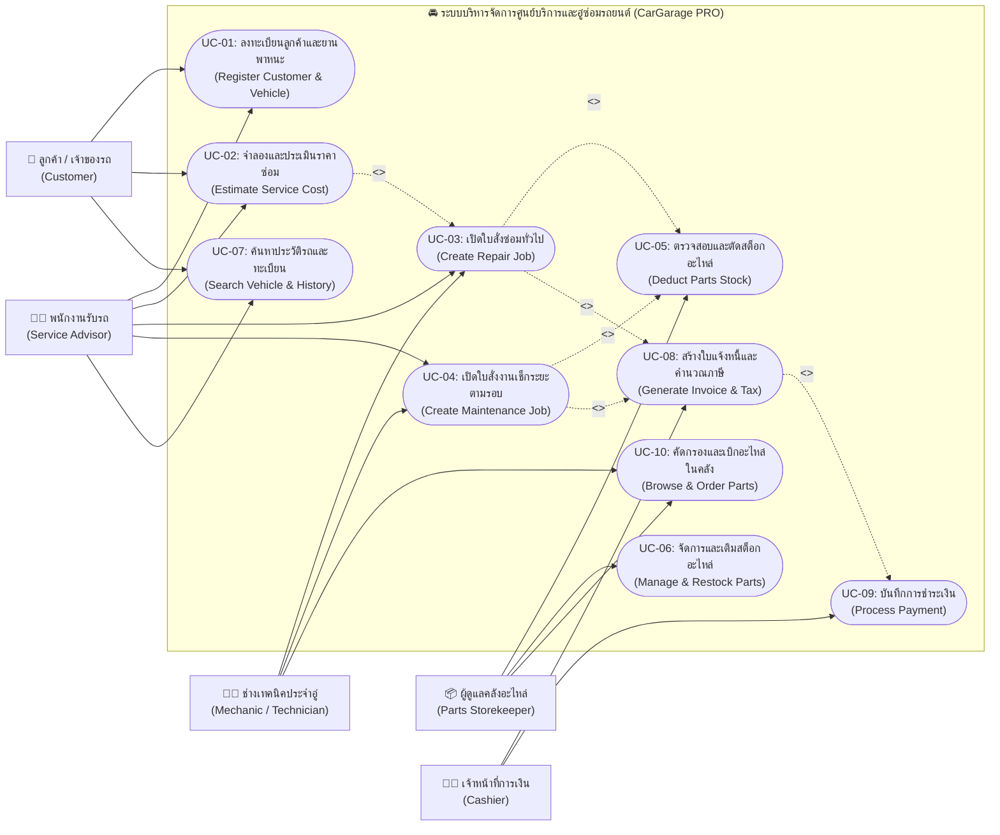
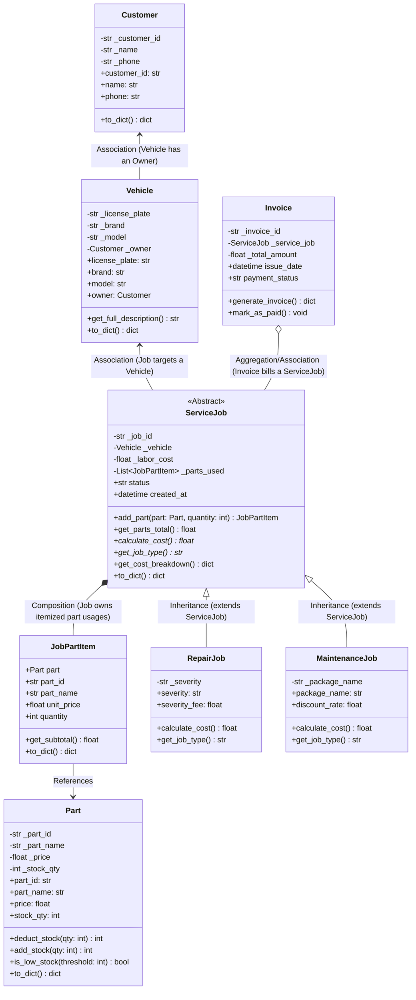

# 🚗 Car Garage & Repair Service Management System (CarGarage PRO)
> **ระบบบริหารจัดการศูนย์บริการและอู่ซ่อมรถยนต์ครบวงจร**  
> **Course Project:** Object-Oriented Programming (OOP) & Object-Oriented Analysis and Design (OOAD)  
> **Architecture:** Decoupled RESTful Architecture — Python FastAPI (Backend) + Next.js App Router & Bootstrap 5 (Frontend)  
> **Repository:** [Kitikon15/Car-Garage-Repair-Service-System](https://github.com/Kitikon15/Car-Garage-Repair-Service-System)

---

## 📋 สารบัญ (Table of Contents)
1. [ภาพรวมของระบบ (System Overview)](#-1-ภาพรวมของระบบ-system-overview)
2. [แผนภาพยูสเคสและบทบาทผู้ใช้งาน (Use Case Diagram & System Actors)](#-2-แผนภาพยูสเคสและบทบาทผู้ใช้งาน-use-case-diagram--system-actors)
3. [รายละเอียดข้อกำหนดยูสเคสเชิงลึก (Detailed Use Case Specifications)](#-3-รายละเอียดข้อกำหนดยูสเคสเชิงลึก-detailed-use-case-specifications)
4. [สถาปัตยกรรม OOP & OOAD Design (Class Diagram)](#-4-สถาปัตยกรรม-oop--ooad-design-class-diagram)
5. [หลักการ OOP ทั้ง 4 เสาหลัก (Core OOP Principles)](#-5-หลักการ-oop-ทั้ง-4-เสาหลัก-core-oop-principles)
6. [ฟังก์ชันเด่นของระบบ (Key System Features)](#-6-ฟังก์ชันเด่นของระบบ-key-system-features)
7. [โครงสร้างโฟลเดอร์โปรเจกต์ (Project Structure)](#-7-โครงสร้างโฟลเดอร์โปรเจกต์-project-structure)
8. [ขั้นตอนการติดตั้งและเริ่มใช้งาน (Getting Started)](#-8-ขั้นตอนการติดตั้งและเริ่มใช้งาน-getting-started)
9. [การทดสอบ API ด้วย cURL / Swagger](#-9-การทดสอบ-api-ด้วย-curl--swagger)
10. [การออกแบบ UI/UX & ระบบธีม (Design & Themes)](#-10-การออกแบบ-uiux--ระบบธีม-design--themes)

---

## 🌟 1. ภาพรวมของระบบ (System Overview)

**CarGarage PRO** เป็นระบบบริหารจัดการงานซ่อมบำรุงและศูนย์บริการรถยนต์ ออกแบบตามหลักการเขียนโปรแกรมเชิงวัตถุ (**Object-Oriented Programming: OOP**) และการวิเคราะห์ออกแบบเชิงวัตถุ (**OOAD**) เพื่อจำลองกระบวนการทำงานจริงของศูนย์บริการยานยนต์มาตรฐาน ตั้งแต่การลงทะเบียนรถยนต์, การเปิดใบสั่งซ่อมบำรุง, การคำนวณราคาประเมินค่าแรงช่าง, การเบิกจ่ายอะไหล่พร้อมตัดสต็อกคลังอัตโนมัติ ไปจนถึงการออกใบแจ้งหนี้และบันทึกการชำระเงิน

---

## 🎯 2. แผนภาพยูสเคสและบทบาทผู้ใช้งาน (Use Case Diagram & System Actors)

ระบบแบ่งบทบาทของผู้ใช้งาน (Actors) ออกเป็น 5 กลุ่ม เพื่อรองรับขั้นตอนการทำงานในอู่ซ่อมรถยนต์ได้อย่างสมบูรณ์:
1. **👤 ลูกค้า / เจ้าของรถ (Customer):** นำรถเข้าตรวจเช็ก, ดูประวัติการซ่อม, ประเมินราคา และชำระเงิน
2. **👨‍💼 พนักงานรับรถ / ที่ปรึกษางานบริการ (Service Advisor):** ลงทะเบียนรถ, เปิดใบสั่งซ่อม (Repair/Maintenance), ประเมินราคา และประสานงาน
3. **👨‍🔧 ช่างเทคนิคประจำอู่ (Technician / Mechanic):** ดำเนินการซ่อมบำรุง, ตรวจสอบอะไหล่ และเบิกใช้อะไหล่ตรงรุ่น
4. **📦 ผู้ดูแลคลังอะไหล่ (Parts Storekeeper):** ตรวจสอบจำนวนอะไหล่, เติมสต็อกสินค้า (Restock) และจัดการแคตตาล็อกอะไหล่
5. **🧑‍💼 เจ้าหน้าที่การเงิน / แคชเชียร์ (Cashier):** ตรวจสอบใบแจ้งหนี้, แจกแจงภาษี VAT 7% และบันทึกการชำระเงิน

### 📊 แผนภาพ Use Case Diagram (UML)



---

## 📝 3. รายละเอียดข้อกำหนดยูสเคสเชิงลึก (Detailed Use Case Specifications)

### 📌 UC-01: ลงทะเบียนลูกค้าและยานพาหนะ (Register Customer & Vehicle)
- **Primary Actor:** พนักงานรับรถ (Service Advisor) / ลูกค้า (Customer)
- **Pre-conditions:** ระบบเปิดใช้งาน และเชื่อมต่อฐานข้อมูลได้ปกติ
- **Main Flow:**
  1. ผู้ใช้เปิดหน้าต่าง "ลงทะเบียนรถ/ลูกค้า" (Register Modal)
  2. ระบุข้อมูลลูกค้า: รหัสลูกค้า, ชื่อ-นามสกุล, เบอร์โทรศัพท์
  3. ระบุข้อมูลรถยนต์: ป้ายทะเบียน, ยี่ห้อ (Brand), รุ่น (Model)
  4. ระบบตรวจสอบความถูกต้องของข้อมูล (Data Validation) ผ่าน Pydantic Schema
  5. ระบบบันทึกข้อมูล Association ระหว่าง `Vehicle` กับ `Customer`
- **Post-conditions:** รถยนต์และลูกค้าถูกผูกเข้าด้วยกัน พร้อมสำหรับการเปิดใบสั่งซ่อมบำรุง
- **OOP Mapping:** `Customer` class (`customer.py`), `Vehicle` class (`vehicle.py`)

---

### 📌 UC-02: จำลองและประเมินราคาซ่อม (Estimate Service Cost)
- **Primary Actor:** พนักงานรับรถ (Service Advisor) / ลูกค้า (Customer)
- **Pre-conditions:** มีข้อมูลรถยนต์และรายการอะไหล่ในระบบ
- **Main Flow:**
  1. ผู้ใช้เลือกยี่ห้อและรุ่นรถยนต์ที่ต้องการประเมิน
  2. เลือกระบบงานซ่อม (เครื่องยนต์, เบรก, น้ำมันเครื่อง, ระบบไฟ ฯลฯ)
  3. เลือกรายการอะไหล่และระบุจำนวนที่ต้องการใช้
  4. กำหนดค่าแรงช่างตามความซับซ้อนของงาน
  5. ระบบคำนวณค่าอะไหล่รวม ค่าแรง และภาษีมูลค่าเพิ่ม 7% แบบเรียลไทม์
  6. ผู้ใช้สามารถส่งข้อมูลประเมินราคาไปเปิดใบสั่งซ่อมจริงได้ทันที (`<<extend>>`)
- **Post-conditions:** แสดงตารางสรุปราคาประเมินค่าซ่อมเบื้องต้นแก่ลูกค้า
- **OOP Mapping:** `GarageBuilder.js`, `ServiceJob.calculate_cost()`

---

### 📌 UC-03: เปิดใบสั่งซ่อมบำรุงทั่วไป (Create Repair Job)
- **Primary Actor:** พนักงานรับรถ (Service Advisor) / ช่างเทคนิค (Mechanic)
- **Pre-conditions:** รถยนต์ต้องลงทะเบียนในระบบแล้ว และอะไหล่ในคลังมีเพียงพอ
- **Main Flow:**
  1. เลือกป้ายทะเบียนรถที่เข้ารับบริการ
  2. ระบุรายละเอียดความเสียหาย และระดับความรุนแรง (`MINOR`, `MODERATE`, `MAJOR`)
  3. เลือกอะไหล่ที่ต้องใช้ พร้อมระบุจำนวน
  4. ระบบตรวจสอบจำนวนสต็อกอะไหล่ (`part.is_low_stock()`)
  5. ระบบหักจำนวนอะไหล่จากคลังอัตโนมัติ (`part.deduct_stock()`) — `<<include>> UC-05`
  6. ระบบคำนวณราคางานซ่อมแบบ Polymorphic:  
     $$\text{Total Cost} = \text{Labor Cost} + \text{Parts Total} + \text{Severity Fee}$$
  7. ระบบสร้างใบแจ้งหนี้อัตโนมัติ (`auto_generate_invoice = true`) — `<<include>> UC-08`
- **Alternate Flow (สต็อกไม่พอ):** ระบบแจ้งเตือนสต็อกไม่เพียงพอ และยกเลิกการสร้างใบสั่งซ่อมเพื่อป้องกันสต็อกติดลบ
- **OOP Mapping:** `RepairJob` class (`service_job.py`), `Part.deduct_stock()` (`part.py`)

---

### 📌 UC-04: เปิดใบสั่งงานเช็กระยะตามรอบ (Create Maintenance Job)
- **Primary Actor:** พนักงานรับรถ (Service Advisor)
- **Pre-conditions:** รถยนต์ลงทะเบียนแล้ว และมีแพ็กเกจระยะทางรองรับ
- **Main Flow:**
  1. เลือกทะเบียนรถยนต์ และเลือกแพ็กเกจเช็กระยะ (`PERIODIC_10K`, `PERIODIC_20K`, `PERIODIC_50K`, `PERIODIC_100K`)
  2. เลือกรายการของเหลว ไส้กรอง และอะไหล่ตามรอบ
  3. ระบบตัดสต็อกอะไหล่ในคลัง — `<<include>> UC-05`
  4. ระบบคำนวณราคางานเช็กระยะแบบ Polymorphic พร้อมหักส่วนลดแพ็กเกจ:  
     $$\text{Total Cost} = (\text{Labor Cost} + \text{Parts Total}) - \text{Package Discount}$$
  5. ระบบสร้างใบแจ้งหนี้เพื่อรอชำระเงิน — `<<include>> UC-08`
- **OOP Mapping:** `MaintenanceJob` class (`service_job.py`)

---

### 📌 UC-05: ตรวจสอบและตัดสต็อกอะไหล่ (Deduct Parts Stock)
- **Primary Actor:** ระบบอัตโนมัติ (System) / ผู้ดูแลคลังอะไหล่ (Parts Storekeeper)
- **Pre-conditions:** มีคำสั่งเบิกจ่ายอะไหล่จากใบสั่งซ่อมหรือตะกร้าสินค้า
- **Main Flow:**
  1. รับคำขอเบิกอะไหล่ตาม `part_id` และจำนวน `quantity`
  2. เมธอด `deduct_stock(quantity)` ตรวจสอบว่า `stock_qty >= quantity` หรือไม่
  3. หากผ่านเงื่อนไข ระบบจะลดจำนวนคงเหลือในคลังทันที
  4. หากสต็อกคงเหลือต่ำกว่าเกณฑ์ ระบบจะติดสถานะ `Low Stock Alert`
- **OOP Mapping:** Encapsulation ใน `Part` class (`part.py`)

---

### 📌 UC-06: จัดการและเติมสต็อกอะไหล่ (Manage & Restock Parts)
- **Primary Actor:** ผู้ดูแลคลังอะไหล่ (Parts Storekeeper)
- **Pre-conditions:** เข้าสู่แท็บจัดการสต็อกอะไหล่ (Parts Inventory)
- **Main Flow:**
  1. ผู้ใช้ดูรายการอะไหล่ทั้งหมด 27 รายการ พร้อมตัวกรองสถานะสต็อก
  2. กดปุ่ม "เติมสต็อก" (Restock) ที่รายการที่ต้องการ
  3. ระบุจำนวนที่ต้องการนำเข้าคลัง
  4. เมธอด `part.add_stock(qty)` ทำการเพิ่มจำนวนสต็อกเข้าสู่ระบบ
- **Post-conditions:** จำนวนสต็อกในคลังอัปเดตแบบเรียลไทม์
- **OOP Mapping:** `Part.add_stock()` (`part.py`), `PartsInventory.js`

---

### 📌 UC-07: ออกใบแจ้งหนี้และบันทึกการชำระเงิน (Generate Invoice & Process Payment)
- **Primary Actor:** เจ้าหน้าที่การเงิน (Cashier) / ลูกค้า (Customer)
- **Pre-conditions:** ใบสั่งซ่อม (RepairJob หรือ MaintenanceJob) ถูกสร้างเรียบร้อยแล้ว
- **Main Flow:**
  1. ระบบนำอ็อบเจกต์ `ServiceJob` ส่งต่อให้คลาส `Invoice`
  2. คลาส `Invoice` เรียก `service_job.calculate_cost()` แบบ Polymorphic เพื่อหายอดรวมสุทธิ
  3. ระบบคำนวณแจกแจง: ค่าแรง, ค่าอะไหล่, ส่วนลด, ภาษีมูลค่าเพิ่ม (VAT 7%)
  4. เจ้าหน้าที่การเงินกดปุ่ม "บันทึกการชำระเงิน" (Mark as Paid)
  5. เมธอด `invoice.mark_as_paid()` เปลี่ยนสถานะเป็น `PAID`
- **Post-conditions:** ใบแจ้งหนี้ถูกบันทึกสถานะชำระเงินเรียบร้อย สามารถพิมพ์หรือดูใบเสร็จย้อนหลังได้
- **OOP Mapping:** `Invoice` class (`invoice.py`), `InvoiceModal.js`

---

## 🏛️ 4. สถาปัตยกรรม OOP & OOAD Design (Class Diagram)

ระบบได้รับการออกแบบโครงสร้างคลาสตามมาตรฐาน OOAD โดยแยกความรับผิดชอบของแต่ละโมเดลอย่างชัดเจน (Single Responsibility Principle) แสดงความสัมพันธ์ผ่าน **Mermaid Class Diagram**:



---

## 🧩 5. หลักการ OOP ทั้ง 4 เสาหลัก (Core OOP Principles)

| หลักการ OOP | การประยุกต์ใช้ในโค้ด (Implementation Details) |
| :--- | :--- |
| **1. การห่อหุ้มข้อมูล (Encapsulation)** | • ใน `backend/models/part.py`: ฟิลด์ `_stock_qty` และ `_price` เป็น private/protected attribute เข้าถึงผ่าน `@property` และ Setter<br>• เมธอด `deduct_stock(qty)` ตรวจสอบเงื่อนไขป้องกันสต็อกติดลบก่อนตัดยอดจริง<br>• ใน `Customer` และ `Vehicle`: ตรวจสอบความถูกต้องของข้อมูลก่อนเซ็ตค่า |
| **2. การสืบทอดคุณสมบัติ (Inheritance)** | • `ServiceJob` ใน `backend/models/service_job.py` เป็น Abstract Base Class (`abc.ABC`) กำหนดโครงสร้างมาตรฐานของงานบริการ<br>• `RepairJob` และ `MaintenanceJob` สืบทอดแอตทริบิวต์ร่วม (`job_id`, `vehicle`, `labor_cost`, `parts_used`, `status`) และเมธอดจัดการอะไหล่จากคลาสแม่ |
| **3. ความหลากหลายของรูปแบบ (Polymorphism)** | • ทั้ง `RepairJob` และ `MaintenanceJob` ทำการ Override เมธอดนามธรรม `calculate_cost()` ด้วยอัลกอริทึมเฉพาะของแต่ละประเภทงาน:<br>&nbsp;&nbsp;• **งานซ่อมทั่วไป (`RepairJob`)**: `Total = labor_cost + parts_total + severity_fee` (คิดค่าความรุนแรงตามระดับงานซ่อม Minor, Moderate, Major)<br>&nbsp;&nbsp;• **งานเช็กระยะ (`MaintenanceJob`)**: `Total = (labor_cost + parts_total) - package_discount` (มอบส่วนลดตามแพ็กเกจระยะทาง 10k, 20k, 50k, 100k)<br>• ใน `backend/models/invoice.py`: เมธอด `Invoice.generate_invoice()` เรียกใช้งาน `self.service_job.calculate_cost()` แบบ Polymorphic โดยไม่ต้องเขียน `if/else` หรือตรวจสอบ `isinstance` |
| **4. ความสัมพันธ์แบบ Composition & Association** | • **Composition (`*--`)**: `ServiceJob` เป็นเจ้าของ `JobPartItem` เมื่อบันทึกการใช้อะไหล่ ข้อมูลราคา ณ ขณะเปิดใบงานจะถูกบันทึกไว้ในรายการ<br>• **Association (`<--`)**: `Vehicle` มีความสัมพันธ์กับ `Customer` ในฐานะเจ้าของรถ โดยทั้งสองสามารถดำรงอยู่อย่างอิสระได้ |

---

## ⚡ 6. ฟังก์ชันเด่นของระบบ (Key System Features)

1. **Garage Operations Command Center (ศูนย์ควบคุมการปฏิบัติการหน้าแรก)**:
   - แบนเนอร์ฮีโร่พร้อมตัวนับสถิติสด (Live Metrics) รถในระบบ, อะไหล่ในคลัง, ใบสั่งซ่อม และสถานะเซิร์ฟเวอร์
   - ปุ่มทางลัดเปิดใบสั่งซ่อมบำรุง, จำลองประเมินราคา, เบิกจ่ายอะไหล่ และค้นหาประวัติรถ
2. **ระบบประเมินราคาซ่อม & เปิดใบสั่งซ่อมบำรุง (Jobs & Repair Cost Estimator)**:
   - จำลองเลือกสเปกอะไหล่และคำนวณค่าแรงแบบเรียลไทม์
   - รองรับทั้งงานซ่อมด่วน (Repair) และงานเช็กระยะบำรุงรักษา (Maintenance)
3. **คลังเบิก-จ่ายอะไหล่มาตรฐาน OEM (Parts Dispensary & Inventory)**:
   - บรรจุข้อมูลอะไหล่รถยนต์จริงกว่า **27 รายการ** ครอบคลุม 10 ระบบงานซ่อม:
     - ระบบของเหลว & น้ำมันเครื่อง, ระบบเบรก & ช่วงล่าง, เครื่องยนต์ & ระบบส่งกำลัง, ระบบระบายความร้อน, ระบบไฟ & แบตเตอรี่, ไส้กรอง, ตัวถัง, อะไหล่ศูนย์ OEM และเครื่องมือช่าง
   - แบรนด์อะไหล่ชั้นนำ: Mobil 1, Castrol, Motul, Brembo, Bendix, NGK, Denso, Bosch, 3M, GS Battery
   - ตรวจจับสต็อกขั้นต่ำ (Low Stock Alert) และมีปุ่มเติมสต็อก (Restock) ทันที
4. **ศูนย์ค้นหาตามรุ่นรถและประวัติ (Vehicle Hub & Fleet Search)**:
   - ค้นหาอะไหล่ที่ตรงรุ่นกับยี่ห้อรถยนต์ยอดนิยม (Toyota, Honda, Isuzu, Ford, Mazda, Nissan, Mitsubishi)
5. **ระบบการเงินและใบแจ้งหนี้ (Billing & Invoices)**:
   - ออกใบเสร็จรับเงิน แจกแจงรายการค่าแรง, ค่าอะไหล่, ส่วนลด, ภาษีมูลค่าเพิ่ม (VAT 7%)
   - รองรับการกดบันทึกการชำระเงิน (Mark as Paid) แบบเรียลไทม์
6. **แถบนำทางเพรียวบาง สบายตา (Sleek Compact Navigation)**:
   - แถบเมนูสีแดงเพรียวบาง 38–40px ข้อความบรรทัดเดียวไม่ตกบรรทัด
   - ปุ่ม Active แท็บทรงแคปซูลโค้งมนพรีเมียม (Gold Pill Accent) พร้อมตะกร้าเบิกอะไหล่

---

## 📂 7. โครงสร้างโฟลเดอร์โปรเจกต์ (Project Structure)

```text
car-garage/
├── backend/
│   ├── models/
│   │   ├── __init__.py           # Package exports
│   │   ├── customer.py           # Customer model (Encapsulation)
│   │   ├── vehicle.py            # Vehicle model (Association with Customer)
│   │   ├── part.py               # Part model (Encapsulation & Stock Guard)
│   │   ├── service_job.py        # ServiceJob (ABC), RepairJob & MaintenanceJob (Inheritance & Polymorphism)
│   │   └── invoice.py            # Invoice model (Polymorphic Billing Calculation)
│   ├── database.py               # In-Memory DB & Realistic Seed Data (27 Parts, Vehicles, Customers)
│   ├── schemas.py                # Pydantic Schemas for Request & Response Validation
│   ├── main.py                   # FastAPI Application & REST Endpoints
│   └── test_api.py               # Backend Unit & Integration Tests
│
├── frontend/
│   ├── app/
│   │   ├── layout.jsx            # Root HTML layout with Bootstrap & Icons
│   │   ├── page.jsx              # Main Dashboard, Tabs Controller & Global State
│   │   └── globals.css           # Custom Garage Themes, Compact Navbar & Card Styles
│   ├── components/
│   │   ├── BootstrapClient.js    # Client-side dynamic loader for Bootstrap 5 JS bundle
│   │   ├── Navbar.js             # Sleek compact garage navigation bar with cart badge
│   │   ├── PromoBannerCarousel.js# Garage Operations Command Center hero section
│   │   ├── StatsCards.js         # Top KPI metrics (Revenue, Invoices, Low Stock, Fleet)
│   │   ├── OrderCatalog.js       # 10-Subsystem Parts Catalog with category & brand filters
│   │   ├── PartsInventory.js     # Real-time stock management table with restock modal
│   │   ├── CreateServiceJob.js   # Polymorphic Job creation form & live preview
│   │   ├── GarageBuilder.js      # Interactive Repair Cost Estimator
│   │   ├── VehicleSearch.js      # Vehicle hub & fleet history search by brand/model
│   │   ├── CartView.js           # Parts requisition cart & order checkout
│   │   ├── InvoiceList.js        # Past service invoices list & status filter
│   │   ├── InvoiceModal.js       # Itemized receipt popup with tax & financial breakdown
│   │   ├── RegisterModal.js      # Vehicle & Customer registration modal
│   │   ├── ContactSales.js       # Garage hotline (02-888-7999), branches & hours
│   │   ├── Footer.js             # High-contrast garage footer (AAA 8.31:1 ratio)
│   │   └── ProductImage.js       # Dynamic SVG & placeholder image handler for parts
│   └── package.json
└── README.md
```

---

## 🚀 8. ขั้นตอนการติดตั้งและเริ่มใช้งาน (Getting Started)

### ความต้องการของระบบ (Prerequisites)
- **Python:** เวอร์ชัน 3.9 หรือใหม่กว่า
- **Node.js:** เวอร์ชัน 18+ และ npm

---

### ขั้นตอนที่ 1: รันระบบฝั่ง Backend (FastAPI)

เปิด Terminal ที่ 1:
```bash
# เข้าโฟลเดอร์โปรเจกต์
cd backend

# ติดตั้ง dependencies ที่จำเป็น (หากยังไม่ได้ติดตั้ง)
pip install fastapi uvicorn pydantic

# เริ่มการทำงานของเซิร์ฟเวอร์
uvicorn main:app --reload --port 8000
```
- **Backend API:** `http://127.0.0.1:8000`
- **Interactive Swagger UI Docs:** `http://127.0.0.1:8000/docs`
- **ReDoc Docs:** `http://127.0.0.1:8000/redoc`

---

### ขั้นตอนที่ 2: รันระบบฝั่ง Frontend (Next.js)

เปิด Terminal ที่ 2:
```bash
# เข้าโฟลเดอร์ frontend
cd frontend

# ติดตั้งแพ็กเกจ (ครั้งแรก)
npm install

# รันเซิร์ฟเวอร์สำหรับนักพัฒนา
npm run dev
```
- **เปิดเบราว์เซอร์เข้าใช้งาน:** `http://localhost:3000`
- **คำสั่ง Build Production:** `npm run build`

---

## 🧪 9. การทดสอบ API ด้วย cURL / Swagger

### 1. ดูรายการอะไหล่ทั้งหมดในคลัง (Parts Catalog)
```bash
curl -X GET http://127.0.0.1:8000/api/parts
```

### 2. สร้างใบสั่งซ่อมทั่วไป (Repair Job — คิดค่าความรุนแรงของงานซ่อม)
```bash
curl -X POST http://127.0.0.1:8000/api/jobs/repair \
  -H "Content-Type: application/json" \
  -d '{
    "license_plate": "1กก-9999",
    "labor_cost": 500.0,
    "description": "เปลี่ยนผ้าเบรกหน้าและเจียรจานเบรก",
    "severity": "MODERATE",
    "parts": [{"part_id": "PART-004", "quantity": 1}],
    "auto_generate_invoice": true
  }'
```

### 3. สร้างงานเช็กระยะตามรอบ (Maintenance Job — มอบส่วนลดตามแพ็กเกจ)
```bash
curl -X POST http://127.0.0.1:8000/api/jobs/maintenance \
  -H "Content-Type: application/json" \
  -d '{
    "license_plate": "2ขข-8888",
    "labor_cost": 400.0,
    "description": "เช็กระยะ 20,000 กม. เปลี่ยนถ่ายน้ำมันเครื่องสังเคราะห์แท้",
    "package_name": "PERIODIC_20K",
    "parts": [{"part_id": "PART-001", "quantity": 1}, {"part_id": "PART-007", "quantity": 1}],
    "auto_generate_invoice": true
  }'
```

### 4. ดึงรายการใบเสร็จและบันทึกการชำระเงิน
```bash
# ดูใบแจ้งหนี้ทั้งหมด
curl -X GET http://127.0.0.1:8000/api/invoices

# บันทึกการชำระเงิน (Mark as Paid)
curl -X POST http://127.0.0.1:8000/api/invoices/INV-001/pay
```

---

## 🎨 10. การออกแบบ UI/UX & ระบบธีม (Design & Themes)

- **โทนสีหลัก (Primary Palette):** Racing Red (`#dc2626`) ผสานความหรูหราด้วยสีทอง Radiant Gold (`#f59e0b` / `#fbbf24`) และพื้นหลังขาวสบายตา
- **สัดส่วนที่กะทัดรัด (Streamlined Navigation):** แถบเมนูด้านบนเพรียวบาง ไม่ซ้อนทับหลายชั้น ไม่บดบังพื้นที่ทำงาน
- **Accessibility & Contrast:** ข้อความสีขาวบนพื้นแดงและพื้นหลังฟุตเตอร์ผ่านเกณฑ์มาตรฐานคอนทราสต์ระดับ **AAA (8.31:1 Ratio)**
- **รองรับธีมหลากหลาย (Multi-Theme Support):**
  - `red-white` (ธีมหลัก: อู่แข่งรถสปอร์ต เรซซิ่งเรด-โกลด์)
  - `cyber` (ไซเบอร์ โคบอลต์บลู)
  - `racing` (มิดไนท์ คาร์บอนดาร์ก)
  - `mode-bw` (โหมดขาว-ดำ Monochrome สำหรับการเข้าถึงและพิมพ์เอกสาร)

---

## 👥 ผู้จัดทำ (Project Members)
- โครงงานวิชา Object-Oriented Programming (OOP) & Object-Oriented Analysis and Design (OOAD)
- พัฒนาด้วยความมุ่งมั่นเพื่อสร้างระบบอู่ซ่อมรถยนต์ที่มีประสิทธิภาพ สวยงาม และถูกต้องตามหลักการเชิงวัตถุอย่างแท้จริง
